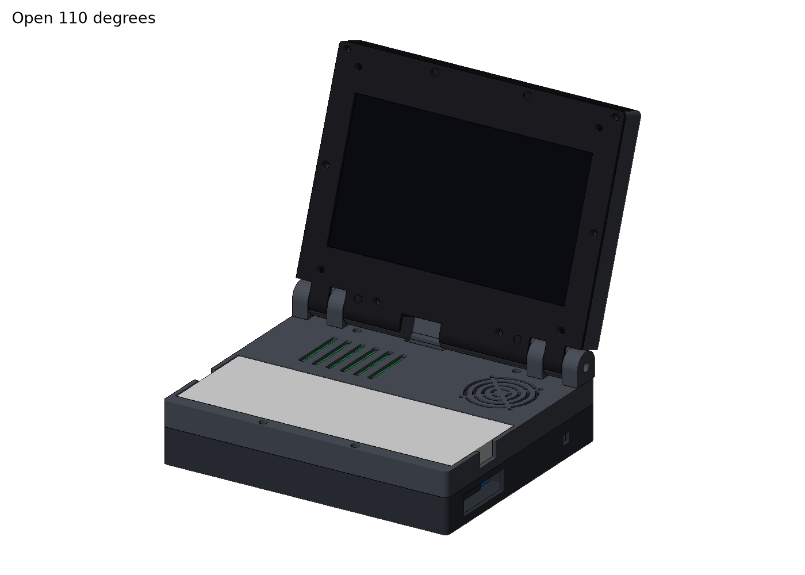

# fusion-pi4: foldable PiDeck cyberdeck

A remix of the [PiDeck 7-inch cyberdeck with Raspberry Pi 5](https://makerworld.com/en/models/2619704-pideck-7-inch-cyberdeck-with-raspberry-pi-5)
into a foldable, small-laptop form factor. It reuses the original build's parts
(7" display, keyboard, Raspberry Pi 5, screws and hardware); only the printed
enclosure changes, splitting into a screen lid and a keyboard base joined by a hinge.

Designed in Autodesk Fusion.

## Repository layout

| Folder        | Contents                                                        |
|---------------|-----------------------------------------------------------------|
| `cad/fusion/` | Native Fusion archives (`.f3d`, or `.f3z` for multi-component designs). The editable source of truth. |
| `cad/cadquery/` | Parametric CadQuery script that generates the STEP and STL files. |
| `cad/step/`   | STEP exports (`.step`) so the model opens in any CAD tool.      |
| `stl/`        | Print-ready meshes (`.stl` or `.3mf`), one file per printed part. |
| `docs/`       | Notes, the export guide and the design report.                  |

## Getting the model

- **Edit it:** open `cad/fusion/*.f3d` in Fusion via *File > Open > Open from my computer*.
- **Other CAD tools (FreeCAD, Onshape, SolidWorks):** import `cad/step/*.step`.
- **Print it:** slice the files in `stl/`.

## Adding new work

See [docs/exporting-from-fusion.md](docs/exporting-from-fusion.md) for how to
export from Fusion and which file goes where.

## Current design (draft 3)



The first draft is a parametric [CadQuery](https://cadquery.readthedocs.io) script in
`cad/cadquery/`, sized from PiDeck V1's own STEP assembly. It writes the STEP files to
`cad/step/` and the print-ready STLs to `stl/`. The design report is in
[docs/foldable-laptop-report.md](docs/foldable-laptop-report.md).

```bash
pip install cadquery
python cad/cadquery/foldable_laptop.py && python cad/cadquery/check_fit.py && python cad/cadquery/render.py
```

## License

Remix of PiDeck by Screase3D, shared under the same CC BY-NC-SA 4.0 license.
