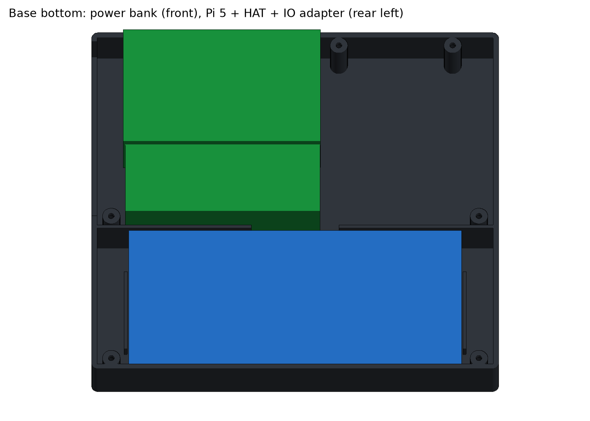
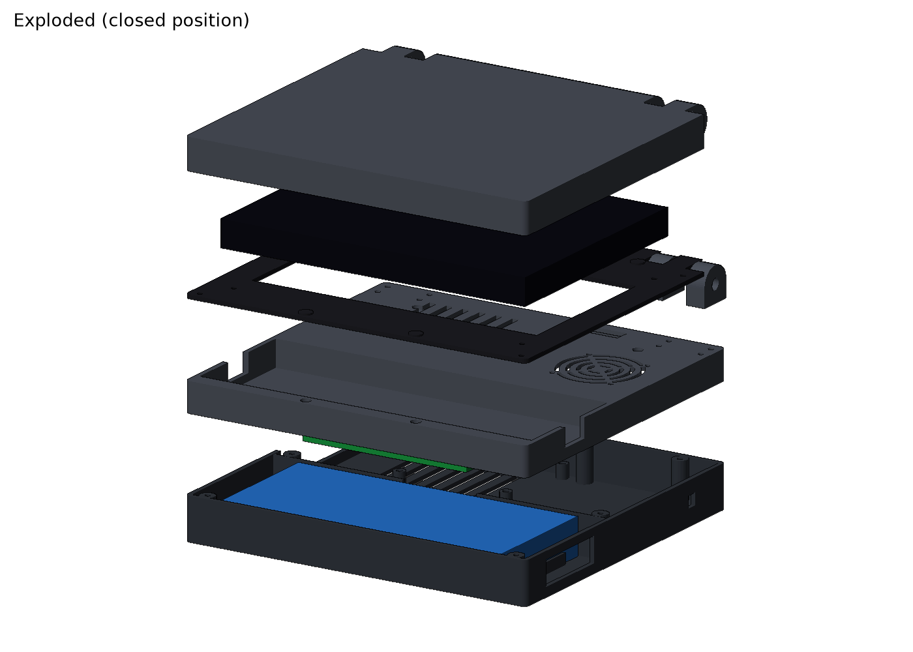
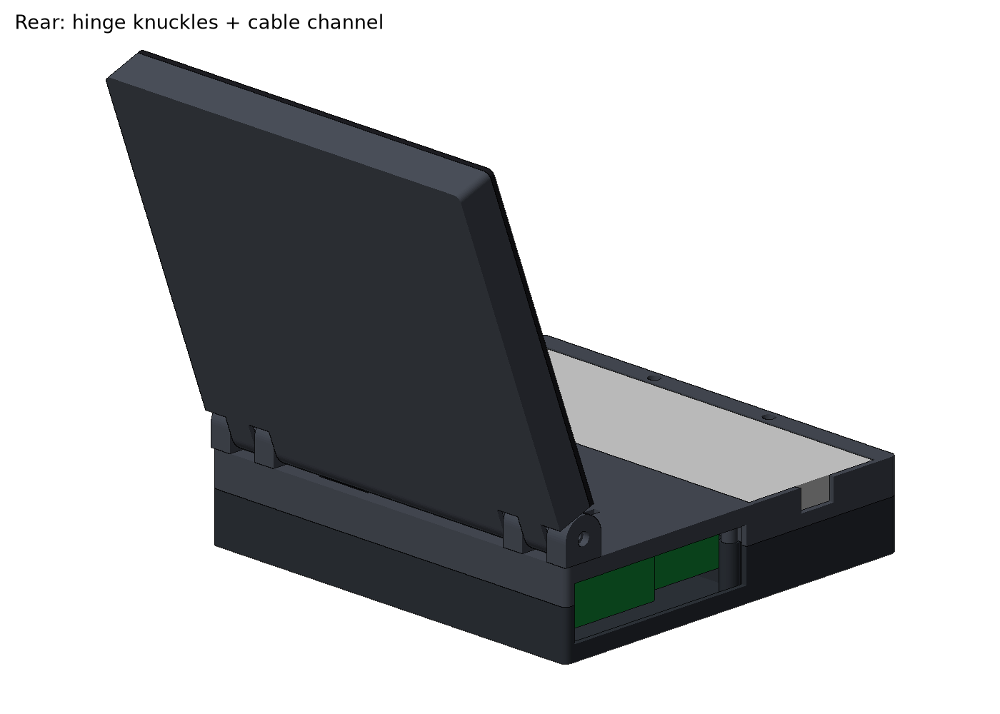
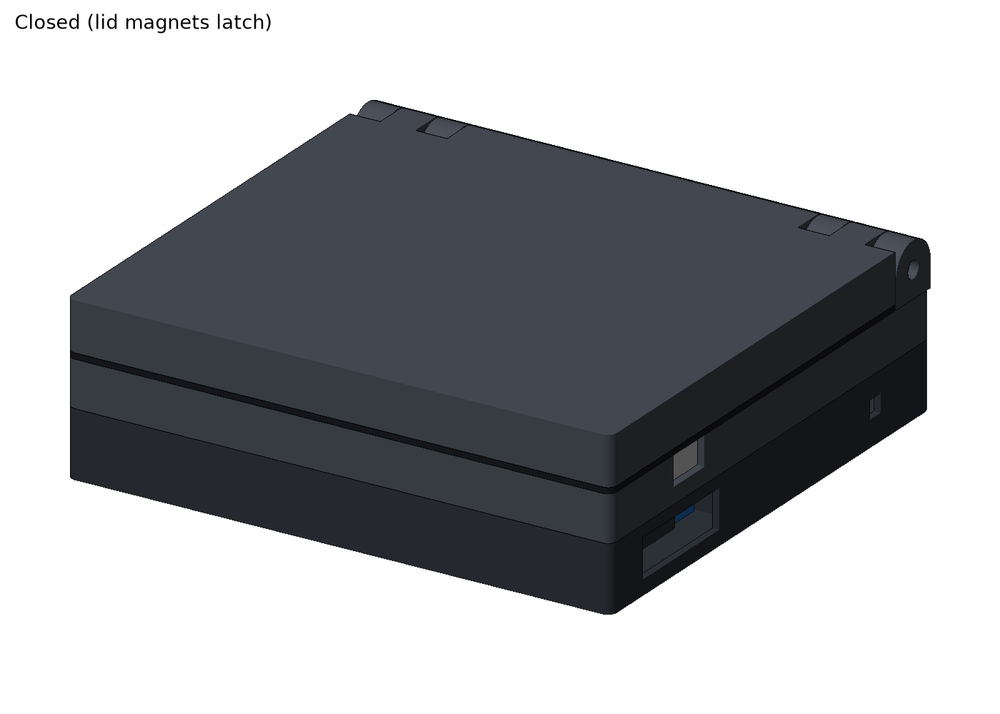

# Foldable PiDeck: design report (draft 2)

A clamshell remix of the [PiDeck 7" cyberdeck](https://makerworld.com/en/models/2619704-pideck-7-inch-cyberdeck-with-raspberry-pi-5)
that keeps PiDeck's parts (Raspberry Pi 5 + Waveshare NVMe HAT + Waveshare IO adapter,
7" IPS touch LCD, Rii X1 mini keyboard, Anker power bank, M2.5 screws + heat-set
inserts, 5x2 magnets) but folds like a small laptop.

Draft 2 uses part sizes measured from PiDeck V1's own STEP assembly
(`Pi_Deck_RaspberryPi5.step`, see `docs/components.md`) instead of datasheet guesses.


## 1. What is in this draft

| File | What it is |
|---|---|
| `cad/cadquery/foldable_laptop.py` | The whole model as a parametric CadQuery script. All bought-part sizes sit in one `Parts` block. |
| `cad/cadquery/check_fit.py` | Checks every printed part is one valid solid, that no part collides with the keyboard, power bank, Pi block or display, and that the lid swings 0 to 150 degrees without hitting the base. |
| `cad/cadquery/render.py` | Makes the PNG previews in `docs/renders/` (software renderer, no GPU needed). |
| `cad/step/*.step` | One STEP per printed part, plus `foldable-assembly-closed.step` and `foldable-assembly-open.step` (110 degrees) with the bought parts as coloured dummies. |
| `stl/*.stl` | Print-ready meshes, already rotated into print orientation. |

Rebuild everything after changing a number:

```bash
pip install cadquery
python cad/cadquery/foldable_laptop.py   # STEP into cad/step/, STL into stl/
python cad/cadquery/check_fit.py         # must end with "ALL OK"
python cad/cadquery/render.py            # refresh docs/renders/*.png
```

### Opening it in Fusion

Use **File > Open > Open from my computer** (or Upload in the Data Panel) on
`cad/step/foldable-assembly-closed.step`. Fusion imports STEP as real B-rep bodies, one
component per part, so you can sketch on faces, add fillets and move holes like a
native design. If you carry on in Fusion, export the `.f3d` into `cad/fusion/` as
described in `docs/exporting-from-fusion.md`. The script stays the source of truth for the big dimensions; Fusion is
the right place for styling (chamfers, logos, texture) once the layout is settled.

## 2. Overall layout

| | Draft 2 (measured parts) | Draft 1 (datasheet guesses) |
|---|---|---|
| Footprint (base and lid) | **186 x 174 mm** | 180 x 136 |
| Base height | **38.2 mm** | 36.8 |
| Lid thickness | **18.6 mm** | 15.5 |
| Closed thickness | **56.8 mm** | 52.3 |
| Open angle tested | 0 to 150 degrees, no collisions | same |

What changed the size:
- The keyboard is **179.4** mm wide (not 152), so the case is 186 wide.
- The screen module is **124.2** mm tall and **14.1** thick including its driver board
  (not 100 x 11), so the lid is deeper and thicker.
- PiDeck's "IO board" is an adapter that plugs into the Pi's micro-HDMI and USB-C edge
  and sticks out **34.6** mm past it. The Pi + HAT + adapter block is
  **90 x 92 x 26.1** mm, and it has to sit behind the keyboard, which is what makes the
  base 174 deep.



**Base, front half:** the power bank lies flat in a bay on the floor. The keyboard
sits on top of it in a pocket in the deck, flush with the surface so the lid closes
flat. Thumb scoops at both ends of the pocket let you lift the keyboard out.

**Base, rear half:** the Pi block sits rear-left on four standoffs with M2.5 heat-set
inserts (the SSD hangs under the HAT between them). The Pi is at the back and the IO
adapter is in front of it. All of its ports face the left wall: the Pi's USB and
Ethernet, and the adapter's two full-size HDMI and USB-C. The block sits 12 mm in from
the wall behind one big I/O window, so plugs with chunky overmoulds still fit. The
right-rear bay is free and holds the optional 4010 fan (under a grill in the deck),
the 6x6 power button in the right wall, and the wiring. A window in the right wall
reaches the power bank's port.

**Lid:** the screen sits face down in the lid when closed, held between a 2 mm bezel
and pressure pads on the back shell. Corner locators centre it, and its own four
mounting holes (157.0 x 114.9 pattern) line up with countersunk M2.5 holes in the bezel,
so it can be screwed in with nuts on the back of the frame. The chin under the screen
(next to the hinge) is about 35 mm, like a normal laptop.

**Latch:** the 8 magnets from the PiDeck kit are reused as 4 pairs, two at the front
edge and two near the hinge, pressed into blind pockets in the deck and the bezel.

## 3. Printed parts

| Part | Print size (mm) | Orientation | Fasteners |
|---|---|---|---|
| `base-bottom` | 186 x 174 x 22.5 | floor down | 6x M2.5x8 countersunk, from deep counterbores in the underside up into `base-top` |
| `base-top` | 186 x 174 x 15.7 | deck face down, no supports | 6 heat-set inserts |
| `hinge-knuckle-left/right-outer`, `hinge-knuckle-left/right-inner` (4 parts) | 18.6 x 18.6 x 10 | on their side, bore vertical | 2x M2.5x8 each from under the deck, insert in the knuckle |
| `lid-back` | 186 x 174 x 16.6 | back plate down | 6 heat-set inserts |
| `lid-bezel` | 186 x 171 x 3 | face down | 6x M2.5x6 countersunk, plus 4x M2.5 + nuts through the screen's holes |



The big parts need a bed of at least 190 x 180 mm (Bambu A1/P1/X1, Prusa MK4 and
Core One all work; an A1 mini is too small). The hinge knuckles are separate parts on
purpose: welded to `base-top` they would stick up above the deck and stop it printing
flat.

## 4. Hinge and cable path



- **Type:** a barrel hinge with three knuckles on each side (base, lid, base). The
  hinge axis sits at the middle of the lid's thickness, 9.3 mm in from the back edge,
  and the lid's back edge is a full half-round around that axis, so the lid never digs
  into the base at any angle (checked by `check_fit.py`).
- **Pin:** one M3x30 socket-head bolt per side. It goes in through the outer knuckle
  (3 mm head recess, so it sits flush) and screws into an M3 nut trapped in the inner
  knuckle. The lid knuckle has a 3.3 mm clearance bore and the base knuckles a 3.0 mm
  bore. Tightening the bolt adds friction so the screen stays where you put it. If it
  is too loose, a nylon washer or a nyloc nut is the next step before a real friction
  hinge.
- **Cable channel:** a 26 mm gap in the hinge, centred 30 mm right of the middle so it
  lands just beside the Pi block. The lid's rounded back edge is open there, and there
  is a 26 x 8 mm slot in the deck just in front of the axis.
- **Cable choice:** a normal HDMI lead will not survive bending in the hinge. Use a
  flat FPC HDMI ribbon (the "FPV HDMI" kits) with a 90 degree HDMI head on the IO
  adapter's inner HDMI port, plus a thin USB lead for touch. Leave a loose loop on the
  base side so the cable isn't pulled tight when the lid opens.

## 5. Parameters and where they came from

All of these are in the `Parts` dataclass at the top of `cad/cadquery/foldable_laptop.py`.

| Parameter | Value | Source |
|---|---|---|
| Keyboard | 179.4 x 64.9 x 13.9 | PiDeck STEP (Rii X1 rounded-edge model). Riitek lists 150 x 60 x 10 for the key body, so confirm with calipers. |
| Screen module | 166.0 x 124.2 x 14.1 | PiDeck STEP |
| Screen holes | 4x d3.3 on 157.0 x 114.9 | PiDeck STEP |
| Visible area (bezel window) | 154.2 x 86, centred | **Guess**: the STEP screen is one solid. Measure the real panel. |
| Pi + HAT stack | 90.1 x 57.7 x 26.1 | PiDeck STEP |
| IO adapter | reaches 34.6 past the Pi, 18.8 thick | PiDeck STEP |
| Power bank | 152.0 x 69.0 x 19.5 | PiDeck STEP (Anker PowerCore III 10K) |
| Heat-set insert hole | 3.4 dia, 4.5 deep | M2.5 x 3.5 x 4 inserts; PiDeck's own bores are 3.5 to 3.9, so tune for your printer |

## 6. Known issues and next steps

1. **Thickness.** The base is 38.2 mm. Swapping the power bank for PiDeck V2's USB-C PD
   module only gets it down to about 32 to 35 mm, because the 26.1 mm Pi + NVMe stack
   then sets the height. Getting it really thin means dropping the NVMe HAT or laying
   the SSD beside the Pi.
2. **The case is deep (174 mm).** That's the 92 mm Pi + IO adapter block behind a 65 mm
   keyboard. Replacing the IO adapter with short micro-HDMI and USB-C cables to the
   left wall would cut about 30 mm off the depth.
3. **Visible area of the screen is a guess.** Measure it before printing the bezel.
4. **Pin friction is untested.** Print the four knuckles and a strip of lid first as a
   test (about 20 minutes) before the large parts.
5. **The I/O window is one generous opening.** Tighten it around the real ports after a
   test fit, or cover it with a magnetic flap like PiDeck does.
6. **The standoff positions assume the SSD fits between them** (it sits under the HAT).
   Check against the real HAT before printing `base-bottom`.
7. **No feet yet.** Add four 10 mm rubber-foot recesses to `base-bottom` in Fusion.

## 7. Bill of materials changes vs. PiDeck

| Item | PiDeck V1 | This remix |
|---|---|---|
| M2.5 countersunk screws | ~17x M2.5x6, 2x M2.5x8, 4x M2.5x5 | 6x M2.5x6 + 4x M2.5 (screen) in the lid, 14x M2.5x8 in the base and knuckles, Pi screws as in PiDeck |
| M2.5 heat-set inserts | ~27 | 6 (base-top) + 8 (knuckles) + 6 (lid-back) + 4 (Pi) = 24 |
| 5x2 magnets | 8 | 8 (4 latch pairs) |
| M3 screws | 4x M3x16 + nuts (fan) | same, **plus 2x M3x30 socket head + 2x M3 nuts (hinge pins)** |
| Display cable | standard HDMI | **flat FPC HDMI ribbon with a 90 degree head (new)** |

## 8. License

PiDeck is CC BY-NC-SA 4.0, so this remix is shared under the same license, credited to
Screase3D.


